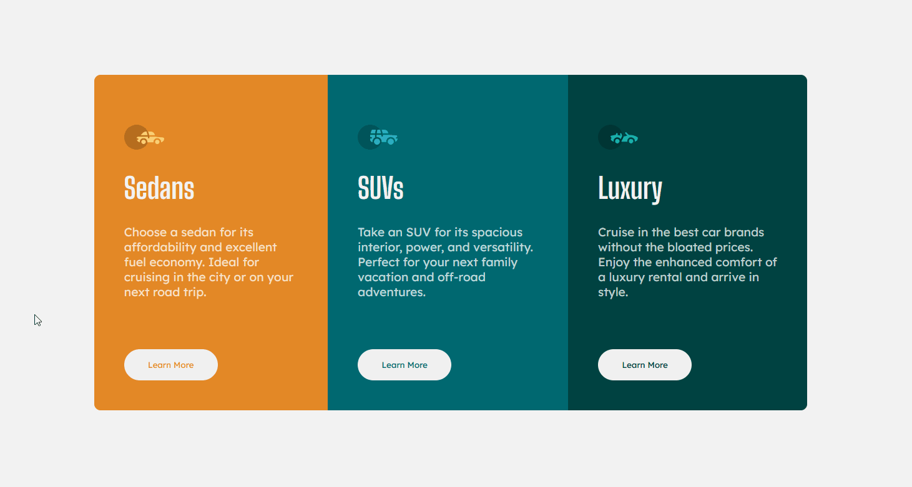
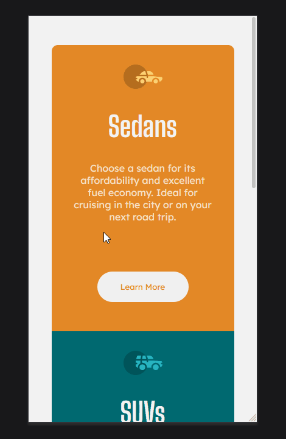

# Frontend Mentor - 3-column preview card component solution

This is a solution to the [3-column preview card component challenge on Frontend Mentor](https://www.frontendmentor.io/challenges/3column-preview-card-component-pH92eAR2-). Frontend Mentor challenges help you improve your coding skills by building realistic projects.

### The challenge

Users should be able to:

- View the optimal layout depending on their device's screen size
- See hover states for interactive elements

### Screenshot

<!---->

### Links

- Solution URL: [Frontend Mentor](https://www.frontendmentor.io/solutions/3-column-preview-sass-pfDNg6bGy)
- Live Site URL: [Netlify](https://cards-preview.netlify.app/)

## Author

- Frontend Mentor - [@popescudragos](https://www.frontendmentor.io/profile/popescudragos)
- Linkedin - [@ospop](https://www.linkedin.com/in/ospop/)
